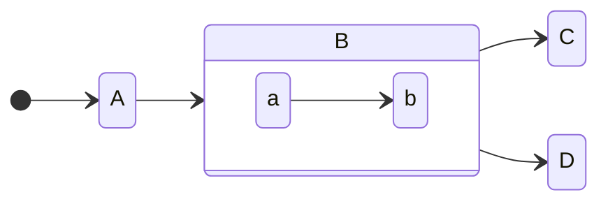

This notion has been in my head for years, but seeing the instructions for
Installing [Rust](https://www.rust-lang.org/tools/install) on Linix made me
want to write this down.

The cut-and-paste instructions are

    curl --proto '=https' --tlsv1.2 -sSf https://sh.rustup.rs | sh

Now `curl https://some.site/some.sh | sh` is mildly spooky on its own,
running a script from the internet. But, the Rust team has a good reputation
and we can assume that the script is safe. But then why the additional
flags on curl? What do they do? Why are they there? Do I need them?

The page gives no explanation. It just says "run this command" and leaves it
at that. This is endemic in developer documentation.

## curl options

- `--proto '=https'` - According to the man page the option "allows scripts to safely
  rely on being able to disable potentially dangerous protocols, without relying upon
  support for that protocol being built into curl to avoid an error. to only use the
  https protocol." In the case of rust install command, this means that curl will
  complain if the URL `https://sh.rustup.rs` doesn't begin with `https:`. Since
  we know exactly what the URL is, this is wholly unnecessary

TODO: I'm still working on this post. I have a lot more to say about this topic.

## how this got to be this way

